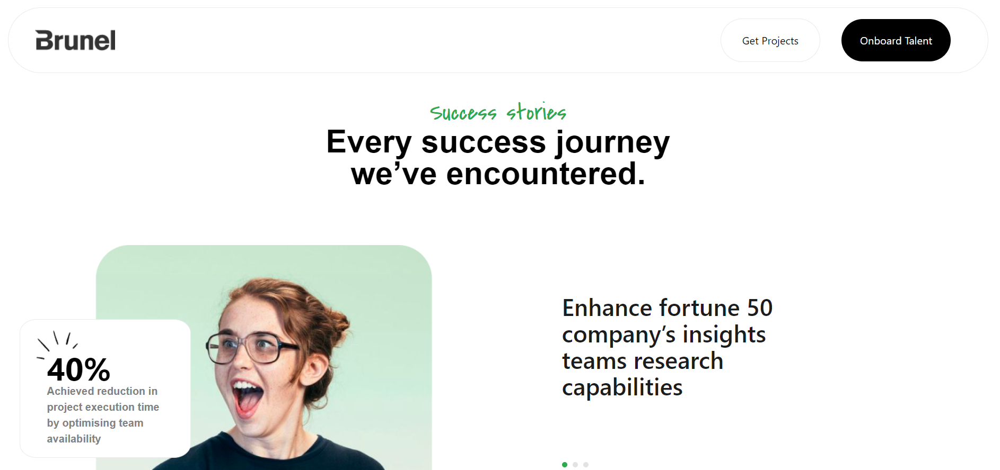
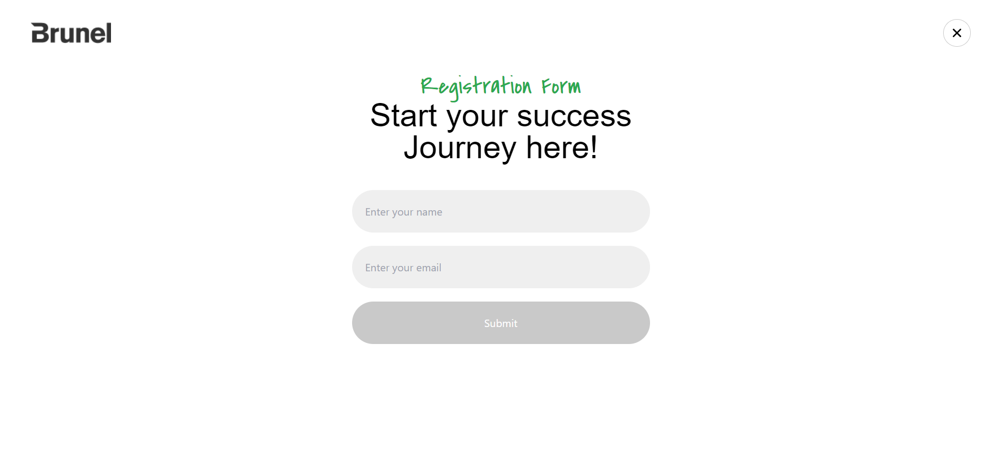
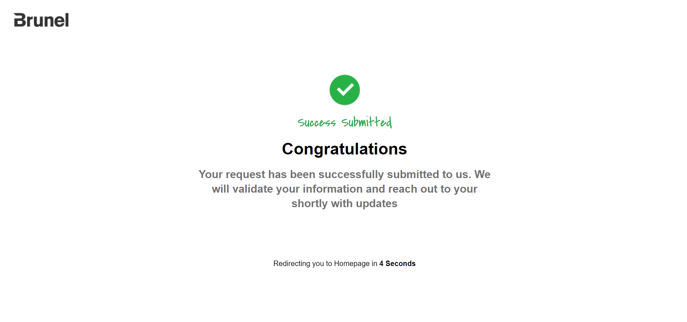

#  Thence - React Intern Assignment 

## Description

This project is a React.js web application developed as part of the Thence intern assignment. It implements various features including React hooks, Tailwind CSS for styling, and React Router DOM for navigation. The project involves designing and developing functional components based on the provided Figma design.

## Features

- Implemented React hooks for state management and lifecycle methods.
- Utilized Tailwind CSS for styling the components.
- Integrated React Router DOM for navigating between different pages.
- Designed and developed functional components based on the provided Figma design.

## Installation

1. Clone the repository: `git clone https://github.com/your/repository.git`
2. Navigate to the project directory: `cd project-directory`
3. Install dependencies: `npm install`

## Usage

1. Start the development server: `npm run dev`
2. Open your browser and navigate to [http://localhost:5173/](http://localhost:5173/)

## Screenshots

## Credits

- [React.js](https://reactjs.org/)
- [Tailwind CSS](https://tailwindcss.com/)
- [React Router DOM](https://reactrouter.com/)
- [Figma](https://www.figma.com/)

## URL

- [Github](https://github.com/rahulvr29/thence-intern-assignment)
- [Vercel](https://thence-intern-assignment.vercel.app/)

